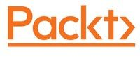

# [Hands-On Meta Learning With Python](https://www.amazon.com/Hands-Meta-Learning-Python-algorithms-ebook/dp/B07KJJHYKF/ref=sr_1_1?ie=UTF8&qid=1543222179&sr=8-1&keywords=meta+learning+hands+on)

###  Learning to Learn using One-Shot Learning, MAML, Reptile, Meta-SGD and more

## About the book

Meta learning is an exciting research trend in machine learning, which enables a model to understand the learning process. Unlike other ML paradigms, with meta learning you can learn from small datasets faster.

Hands-On Meta Learning with Python starts by explaining the fundamentals of meta learning and helps you understand the concept of learning to learn. You will delve into various one-shot learning algorithms, like siamese, prototypical, relation and memory-augmented networks by implementing them in TensorFlow and Keras. As you make your way through the book, you will dive into state-of-the-art meta learning algorithms such as MAML, Reptile, and CAML. You will then explore how to learn quickly with Meta-SGD and discover how you can perform unsupervised learning using meta learning with CACTUs. In the concluding chapters, you will work through recent trends in meta learning such as adversarial meta learning, task agnostic meta learning, and meta imitation learning.

By the end of this book, you will be familiar with state-of-the-art meta learning algorithms and able to enable human-like cognition for your machine learning models.

## Get the book 

  

<a target="_blank" href="https://books.google.co.in/books?id=yx2CDwAAQBAJ&dq=Hands-On+Meta+Learning+with+Python&source=gbs_navlinks_s">
  

 

 

### Awesome Meta Learning  

Check the curated list of Meta Learning papers, code, books, blogs, videos, datasets and other resources [here.](https://github.com/sudharsan13296/Awesome-Meta-Learning) 

## Table of contents 

### [1. Introduction to Meta Learning](https://github.com/sudharsan13296/Hands-On-Meta-Learning-With-Python/tree/master/01.%20Introduction%20to%20Meta%20Learning)

* [1.1. What is Meta Learning?](https://github.com/sudharsan13296/Hands-On-Meta-Learning-With-Python/blob/master/01.%20Introduction%20to%20Meta%20Learning/1.1%20What%20is%20Meta%20Learning.ipynb)
* 1.2. Meta Learning and Few-Shot
* 1.3. Types of Meta Learning
* 1.4. Learning to Learn Gradient Descent by Gradient Descent
* 1.5. Optimization As a Model for Few-Shot Learning

### [2. Face and Audio Recognition using Siamese Network](https://github.com/sudharsan13296/Hands-On-Meta-Learning-With-Python/tree/master/02.%20Face%20and%20Audio%20Recognition%20using%20Siamese%20Networks)

* [2.1. What are Siamese Networks?](https://github.com/sudharsan13296/Hands-On-Meta-Learning-With-Python/blob/master/02.%20Face%20and%20Audio%20Recognition%20using%20Siamese%20Networks/2.1.%20What%20are%20Siamese%20Networks%3F.ipynb)
* 2.2. Architecture of Siamese Networks
* 2.3. Applications of Siamese Networks
* [2.4. Face Recognition Using Siamese Networks](https://github.com/sudharsan13296/Hands-On-Meta-Learning-With-Python/blob/master/02.%20Face%20and%20Audio%20Recognition%20using%20Siamese%20Networks/2.4%20Face%20Recognition%20Using%20Siamese%20Network.ipynb)
* [2.5. Audio Recognition Using Siamese Networks](https://github.com/sudharsan13296/Hands-On-Meta-Learning-With-Python/blob/master/02.%20Face%20and%20Audio%20Recognition%20using%20Siamese%20Networks/2.5%20Audio%20Recognition%20using%20Siamese%20Network.ipynb)

### [3. Prototypical Network and its variants](https://github.com/sudharsan13296/Hands-On-Meta-Learning-With-Python/tree/master/03.%20Prototypical%20Networks%20and%20its%20Variants)

* [3.1. Prototypical Network](https://github.com/sudharsan13296/Hands-On-Meta-Learning-With-Python/blob/master/03.%20Prototypical%20Networks%20and%20its%20Variants/3.1%20Prototypical%20Networks.ipynb)
* 3.2. Algorithm of Prototypical Network
* [3.3. Omniglot character set classification using prototypical network](https://github.com/sudharsan13296/Hands-On-Meta-Learning-With-Python/blob/master/03.%20Prototypical%20Networks%20and%20its%20Variants/3.3%20Omniglot%20Character%20set%20classification%20using%20Prototypical%20Network.ipynb)
* 3.4. Gaussian Prototypical Network
* 3.5. Algorithm
* 3.6. Semi prototypical Network

### [4. Relation and Matching Networks Using Tensorflow](https://github.com/sudharsan13296/Hands-On-Meta-Learning-With-Python/tree/master/04.%20Relation%20and%20Matching%20Networks%20Using%20Tensorflow)

* 4.1. Relation Networks
* [4.2. Relation Networks in One-Shot Learning](https://github.com/sudharsan13296/Hands-On-Meta-Learning-With-Python/blob/master/04.%20Relation%20and%20Matching%20Networks%20Using%20Tensorflow/4.2%20Relation%20Networks%20in%20One-Shot%20Learning.ipynb)
* 4.3. Relation Networks in Few-Shot Learning 
* 4.4. Relation Networks in Zero-Shot Learning
* [4.5. Building Relation Networks using Tensorflow](https://github.com/sudharsan13296/Hands-On-Meta-Learning-With-Python/blob/master/04.%20Relation%20and%20Matching%20Networks%20Using%20Tensorflow/4.5%20Building%20Relation%20Network%20Using%20Tensorflow.ipynb)
* [4.6. Matching Networks](https://github.com/sudharsan13296/Hands-On-Meta-Learning-With-Python/blob/master/04.%20Relation%20and%20Matching%20Networks%20Using%20Tensorflow/4.6%20Matching%20Networks.ipynb)
* 4.7. Embedding Functions
* 4.8. Architecture of Matching Networks
* [4.9. Matching Networks in Tensorflow](https://github.com/sudharsan13296/Hands-On-Meta-Learning-With-Python/blob/master/04.%20Relation%20and%20Matching%20Networks%20Using%20Tensorflow/4.9%20Matching%20Networks%20Using%20Tensorflow.ipynb)

### [5. Memory Augmented Networks](https://github.com/sudharsan13296/Hands-On-Meta-Learning-With-Python/tree/master/05.%20Memory%20Augmented%20Networks)

* [5.1. Neural Turing Machine](https://github.com/sudharsan13296/Hands-On-Meta-Learning-With-Python/blob/master/05.%20Memory%20Augmented%20Networks/5.1%20Neural%20Turing%20Machine.ipynb)
* 5.2. Reading and Writing in NTM
* 5.3. Addressing Mechansims
* [5.4. Copy Task using NTM](https://github.com/sudharsan13296/Hands-On-Meta-Learning-With-Python/blob/master/05.%20Memory%20Augmented%20Networks/5.4%20Copy%20Task%20Using%20NTM.ipynb)
* 5.5. Memory Augmented Neural Networks
* 5.6. Reading and Writing in MANN
* [5.7. Building MANN in Tensorflow](https://github.com/sudharsan13296/Hands-On-Meta-Learning-With-Python/blob/master/05.%20Memory%20Augmented%20Networks/5.7%20Building%20MANN%20in%20Tensorflow%20.ipynb)

### [6. MAML and its variants](https://github.com/sudharsan13296/Hands-On-Meta-Learning-With-Python/tree/master/06.%20MAML%20and%20it's%20Variants)

* [6.1. Model Agnostic Meta Learning](https://github.com/sudharsan13296/Hands-On-Meta-Learning-With-Python/blob/master/06.%20MAML%20and%20it's%20Variants/6.1%20Model%20Agnostic%20Meta%20Learning.ipynb)
* [6.2. MAML Algorithm](https://github.com/sudharsan13296/Hands-On-Meta-Learning-With-Python/blob/master/06.%20MAML%20and%20it's%20Variants/6.2%20MAML%20ALgorithm.ipynb)
* [6.3. MAML in Supervised Learning](https://github.com/sudharsan13296/Hands-On-Meta-Learning-With-Python/blob/master/06.%20MAML%20and%20it's%20Variants/6.3%20MAML%20in%20Supervised%20Learning.ipynb)
* 6.4. MAML in Reinforcement Learning
* [6.5. Building MAML from Scratch](https://github.com/sudharsan13296/Hands-On-Meta-Learning-With-Python/blob/master/06.%20MAML%20and%20it's%20Variants/6.5%20Building%20MAML%20From%20Scratch.ipynb)
* 6.6. Adversarial Meta Learning
* [6.7. Building ADML from Scratch](https://github.com/sudharsan13296/Hands-On-Meta-Learning-With-Python/blob/master/06.%20MAML%20and%20it's%20Variants/6.7%20Building%20ADML%20From%20Scratch.ipynb)
* 6.8. CAML
* 6.9. CAML Algorithm

### [7. Meta-SGD and Reptile Algorithms](https://github.com/sudharsan13296/Hands-On-Meta-Learning-With-Python/tree/master/07.%20Meta-SGD%20and%20Reptile%20Algorithms)

* [7.1. Meta-SGD](https://github.com/sudharsan13296/Hands-On-Meta-Learning-With-Python/blob/master/07.%20Meta-SGD%20and%20Reptile%20Algorithms/7.1%20Meta-SGD.ipynb)
* 7.2. Meta-SGD in Supervised Learning
* 7.3. Meta-SGD in Reinforcement Learning
* [7.4. Building Meta-SGD from Scratch](https://github.com/sudharsan13296/Hands-On-Meta-Learning-With-Python/blob/master/07.%20Meta-SGD%20and%20Reptile%20Algorithms/7.4%20Building%20Meta-SGD%20from%20Scratch.ipynb)
* 7.5. Reptile
* 7.6. Reptile Algorithm
* [7.7. Sine Wave Regression Using Reptile](https://github.com/sudharsan13296/Hands-On-Meta-Learning-With-Python/blob/master/07.%20Meta-SGD%20and%20Reptile%20Algorithms/7.7%20Sine%20wave%20Regression%20Using%20Reptile.ipynb)

### [8. Gradient Agreement as an Optimization Objective](https://github.com/sudharsan13296/Hands-On-Meta-Learning-With-Python/tree/master/08.%20Gradient%20Agreement%20As%20An%20Optimization%20Objective)

* [8.1. Gradient Agreement](https://github.com/sudharsan13296/Hands-On-Meta-Learning-With-Python/blob/master/08.%20Gradient%20Agreement%20As%20An%20Optimization%20Objective/8.1%20Gradient%20Agreement%20as%20an%20Optimization.ipynb)
* 8.2. Weight Calculation
* 8.3. Gradient Agreement Algorithm
* [8.4. Building Gradient Agreement with MAML from scratch](https://github.com/sudharsan13296/Hands-On-Meta-Learning-With-Python/blob/master/08.%20Gradient%20Agreement%20As%20An%20Optimization%20Objective/8.4%20Building%20Gradient%20Agreement%20Algorithm%20with%20MAML.ipynb)

### [9. Recent Advancements and Next Steps](https://github.com/sudharsan13296/Hands-On-Meta-Learning-With-Python/tree/master/09.%20Recent%20Advancements%20and%20Next%20Steps)

* 9.1. Task Agnostic Meta Learning
* 9.2. TAML Algorithm
* [9.3. Meta Imitation Learning](https://github.com/sudharsan13296/Hands-On-Meta-Learning-With-Python/blob/master/09.%20Recent%20Advancements%20and%20Next%20Steps/9.3%20Meta%20Imitation%20Learning.ipynb)
* 9.4. MIL Algorithm
* 9.5. CACTUs
* 9.6. Task Generation using CACTUs
* 9.7. Learning to Learn in the Concept Space 
